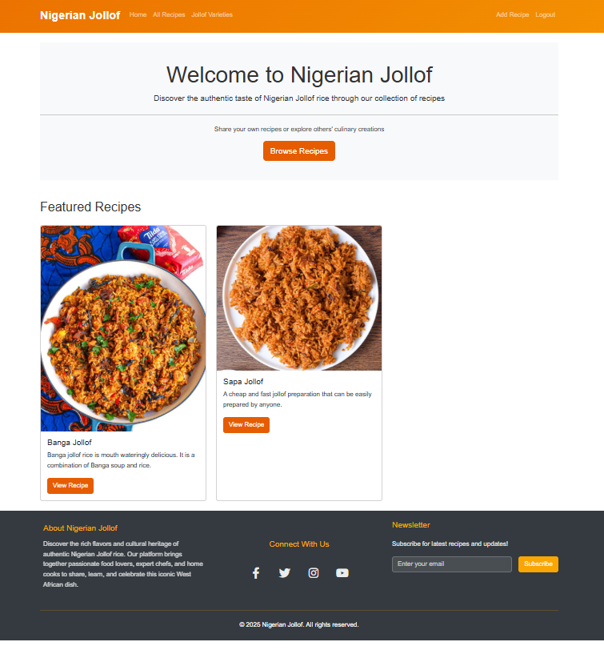
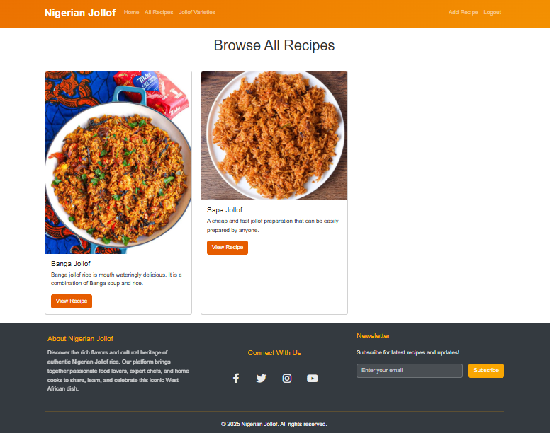
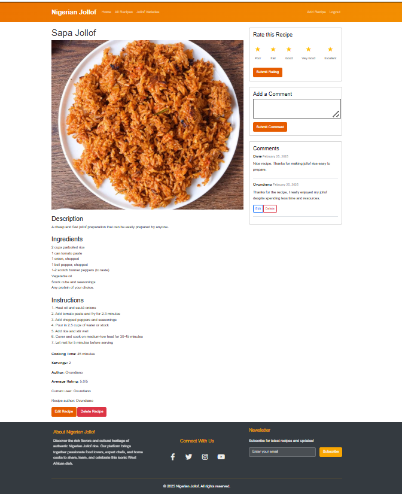
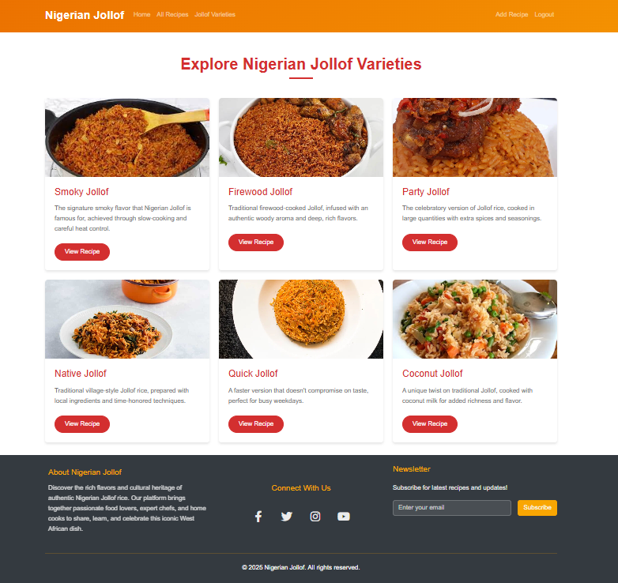
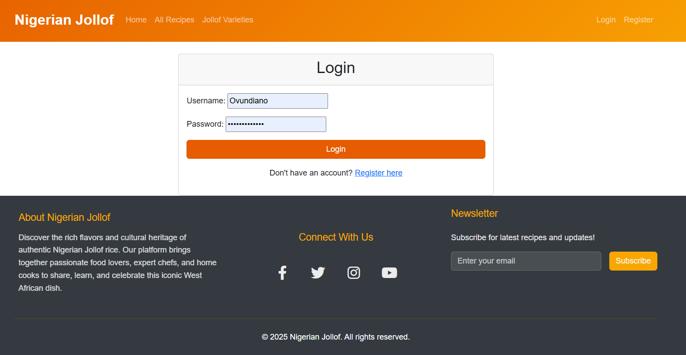
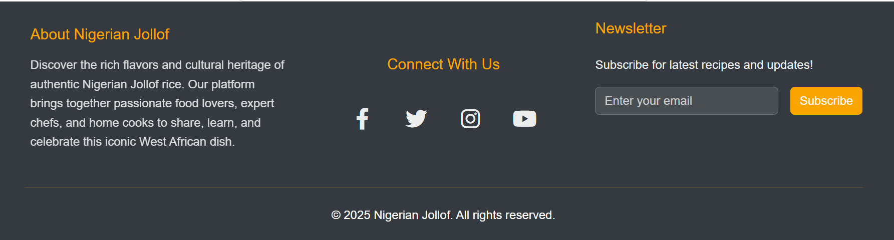
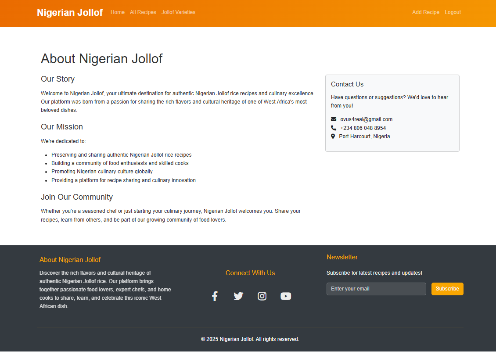
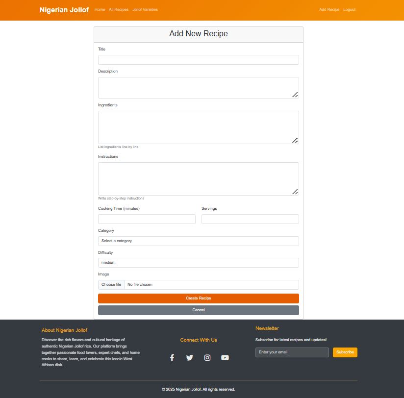
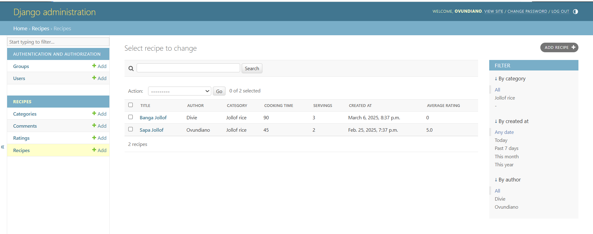

# Nigerian Jollof Recipe Website
Nigerian Jollof Recipe Website is a Django-based web application dedicated to sharing and celebrating the rich culinary tradition of Nigerian Jollof rice. This platform allows users to browse various Jollof rice recipes, share their own recipes, rate and comment on recipes, and learn about different varieties of this iconic West African dish.

Here is the link to Nigerian Jollof Recipe Website-heroku where details on varieties of recipes are learnt [link]( https://nigerian-jollof-app-2297eafa2882.herokuapp.com/)


### This is Portfolio Project 4 for Full Stack Developer Diploma taught through Code Institute

## Table of Contents
- [Features](#Features)
- [UX - layout](#UX-layout)
- [Wireframes](#Wireframes)
- [Installation](#Installation)
- [Usage](#Usage)
- [Deployment](#Deployment)
- [Technologies Used](#Technologies-Used)
- [Testing](#Testing)
- [Project Limitations](#Project-Limitations)
- [Acknowledgements](#Acknowledgements)

## Features

### User Authentication
- User registration and login
- Profile management
- Authentication required for certain actions (adding recipes, commenting, rating)

### Recipe Management
- Browse recipes with pagination
- View detailed recipe information
- Create, read, update, and delete recipes (CRUD functionality)
- Recipe categorization by variety (Smoky, Firewood, Party, Native, Quick, Coconut)

### Social Features
- Comment on recipes
- Rate recipes (1-5 stars)
- Edit and delete your own comments

### Content
- Featured recipes on homepage
- Detailed information about Jollof varieties
- About page with information about Nigerian Jollof


## UX - layout
   ### Home Page
   This is the first page you see when opening the site. It has a brief welcome address and description of the site and also a directional clickable link that directs you the all recipe page.

   

   ### All Recipe Page
   This is the next page where added recipes by users are being saved and also allows users to browse paginated view of recipes added by current user and other users. Each recipe is clickable and takes users to a new page for detailed information on ingredients, instructions, cooking time etc for each recipe clicked. It also allows registered users to rate, comment, edit and delete comment on each recipe and also allows recipe author to edit and delete recipe added.

   

   


   ### Jollof Varieties Page
   This is the page where varieties of jollof rice recipes added by me the author is being saved. It has paginated view of jollof varieties with each recipe being clickable and linked to a new page for detailed information on how and what to use in preparation of varieties of Nigerian Jollof.

   

   ### Login Page
   This is the page that allows existing users to login, either to add, edit, delete, rate and comment on recipes added by existing user or other users. It also has a clickable link that is link to the register page where new users can register.

   

   ### Register Page
   This is the page that allows new users to register there details to enable them to login and have full access to the site.

   

   ### Footer
   The footer is found at the bottom of every page. It contains the link to the about page, link to the connect with us pages i.e our different social media handles, newsletter subscription and copyright.

   

   ### My About Page
   This page has the detailed description of what Nigerian Jollof website is all about. Our story, our mission, why you need to join our community and explore our jollof varieties of recipe. It also has our contact details.

   

   ### Add Recipe Page
   This page has the form where registered users can create there own recipes so it can be saved in the all recipes page.

   

   ### NavBar
   It has a fully functional navbar:
   
   

   ### Admin Dashboard

   

## Wireframe
  - Wireframes were created for mobile, tablet and desktop using wireframe.cc .


 

## Installation

   ### Prerequisites
   The following tools were installed during the course of building this site.
   - Python 3.8+
   - Django 4.x
   - PostgreSQL (or SQLite for development)
   - Git
   - pip

   ### Clone the Repository
   I had to clone the repository to my local machine using 
   ```https://github.com/Ovundiano/nigerian_jollof.git```

   ````
   cd nigerian-jollof
   `````

   ### Environment Setup
   I had to Create a virtual environment and activate it
   ```
    python -m venv venv
    source venv/bin/activate
   ```

   I had to install dependencies, during the cause of creating this site 
   ```pip3 install -r requirements.txt```

   Furthermore I had to create an env.py file and configure environment variables directly:
   ```
   import os
   os.environ["SECRET_KEY"] = "my-secret-key"
   os.environ["DEBUG"] = "True"  # Set to "False" 
   os.environ["DATABASE_URL"] = "my-database-url"
   ```

   ### Database Configuration
   By default, the system supports both PostgreSQL (preferred for production) and SQLite (default fallback).
   and Apply database migrations: 
   ```
   python manage.py makemigrations
   python manage.py migrate
   ```
   
   ### Running the Application
   Start the development server by ```python manage.py runserver```

   ### Create a superuser
   Create superuser for admin by ```python manage.py createsuperuser```

   ### Running Tests
   Run the test suite by ```python manage.py test```

## Usage

   ### Admin Panel
   Access the admin panel at ```http://127.0.0.1:8000/admin/``` to manage recipes, users, comments, and ratings.

   ### Adding a Recipe
   - Log in to your account
   - Navigate to the "Add Recipe" page
   - Fill out the form with your recipe details
   - Upload an image
   - Click "Submit"

   ### Rating and Commenting
   - Navigate to a recipe detail page
   - Use the star rating system to rate the recipe
   - Use the comment form to leave a comment
   - You can edit or delete your own comments

## Deployment

### Important point for this project

This is a django project, as such it has been built with the django framework, in order to maintain a level of security for certain variables, they are stored within a secret file env.py.  This file **IS NOT** stored within the project, it must be recreated if you are starting a new workspace, please ensure you use your own details for this.

## Local Development and Deployment

- The program was deployed to [Heroku](https://dashboard.heroku.com).

### Local Development

#### How to Fork
1. Log in (or sign up) to Github.
2. Go to the repository for this project, [Nigerian Jollof Recipe Website](https://github.com/Ovundiano/nigerian_jollof.git)
3. Click the Fork button in the top right corner.

#### How to Clone

To clone the repository:

1. Log in (or sign up) to GitHub.
2. Go to the repository for this project, [Nigerian Jollof Recipe Website](https://github.com/Ovundiano/nigerian_jollof.git)
3. Click on the code button, select whether you would like to clone with HTTPS, SSH or GitHub CLI and copy the link shown.
4. Open the terminal in your code editor and change the current working directory to the location you want to use for the cloned directory.
5. Type 'git clone' into the terminal and then paste the link you copied in step 3. Press enter.

### Important Information about forking a repository

- Forking allows you to make any changes without affecting original project. You can send the the suggestions by submitting a pull request. Then the Project Owner can review the pull request before accepting the suggestions and merging them.

- When you have fork to a repository, you don't have access to files locally on your device, for getting access you will need to clone the forked repository.
- For more details on how to fork the repo, in order to for example suggest any changes to the project you can:
[Forking a Repository](https://docs.github.com/en/get-started/quickstart/fork-a-repo)

## Technologies Used

These are the list of technologies I used while building this site:
***

- asgiref - version 3.8.1
- black - version 25.1.0
- cairocffi - version 1.7.1
- certifi - version 2025.1.31
- cffi - version 1.17.1
- charset-normalizer - version 3.4.1
- click - version 8.1.8
- colorama - version 0.4.6
- crispy-bootstrap5 - version2024.10
- cssselect2 - version 0.7.0
- defusedxml - version 0.7.1
- dj-database-url - version 2.3.0
- Django - version 4.2.19
- django-crispy-forms - version 2.3
- django-widget-tweaks - version 1.5.0
- gunicorn - version 23.0.0
- idna - version 3.10
- mypy-extensions - version 1.0.0
- packaging - version 24.2
- pathspec - version 0.12.1
- pillow - version 11.1.0
- platformdirs - version 4.3.6
- psycopg2-binary - version 2.9.10
- pycparser - version 2.22
- requests - version 2.32.3
- six - version 1.17.0
- sqlparse - version 0.5.3
- tinycss2 - version 1.4.0
- typing_extensions - version 4.12.2
- tzdata - version 2025.1
- urllib3 - version 2.3.0
- webencodings - version 0.5.1
- whitenoise - version 6.9.0
- pip - version 25.0.1
- [](https://www.python.org/) used for the functionality of the inside gubins of the website.
- [](https://en.wikipedia.org/wiki/HTML) used for the main site content.
- [](https://en.wikipedia.org/wiki/CSS) used for the main site design and layout.
- [](https://www.javascript.com) used for user interaction on the site.
- [](https://git-scm.com) used for version control. (`git add`, `git commit`, `git push`)
- [](https://code.visualstudio.com/) used as a cloud-based IDE for development.
- [](https://github.com) used for secure online code storage.
- [](https://www.heroku.com/) Used to deploy the project.
- [](https://codeinstitute.net/global/) Gitpod Template - to generate the workspace for the project.

### Technologies used to Design the website
***

- [TechSini](https://techsini.com/multi-mockup/) To create mockup image.
- [FontAwesome](https://fontawesome.com/) Icons.
- [Goggle Fonts](https://fonts.google.com/) For website fonts.

## Testing

- The portal has been well tested and the results can be viewed [here - TESTING](TESTING.md)

## Project Limitations

### Time Constraints
- The project was developed within a limited timeframe, which affected the scope of features implemented
- Certain advanced features were prioritized based on core functionality requirements
- UI/UX refinements were focused on critical user journeys rather than comprehensive styling

### Infrastructure Limitations
- AWS S3 integration was not implemented due to configuration constraints
- Current implementation uses local file storage for media/image uploads
- This approach is suitable for development but presents scalability challenges in production

### Future Improvements
- Implement AWS S3 or similar cloud storage solution for media files
- This would improve:
  - Application scalability
  - File storage reliability
  - Content delivery performance
  - Backup and disaster recovery capabilities
- Temporary workaround: Manual media backup procedures are in place to mitigate data loss risks

## Acknowledgements
 - I give Special thanks to my wife Divine Mazi, who has been a great support system to me through out the journey of the project.
 -  [Iuliia Konovalova](https://github.com/IuliiaKonovalova) thanks for your support and great guidance.
 -  [Code Institute](https://codeinstitute.net/) tutors and Slack community members for their support and help.
 -  [Developing with Django](https://codeinstitute.net/) tutorial.
 -  [Ebuka-martins](https://github.com/Ebuka-martins) my friend who has been very supportive to me throughout the journey of the project.

#### back to [top](#table-of-contents)
