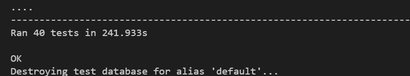
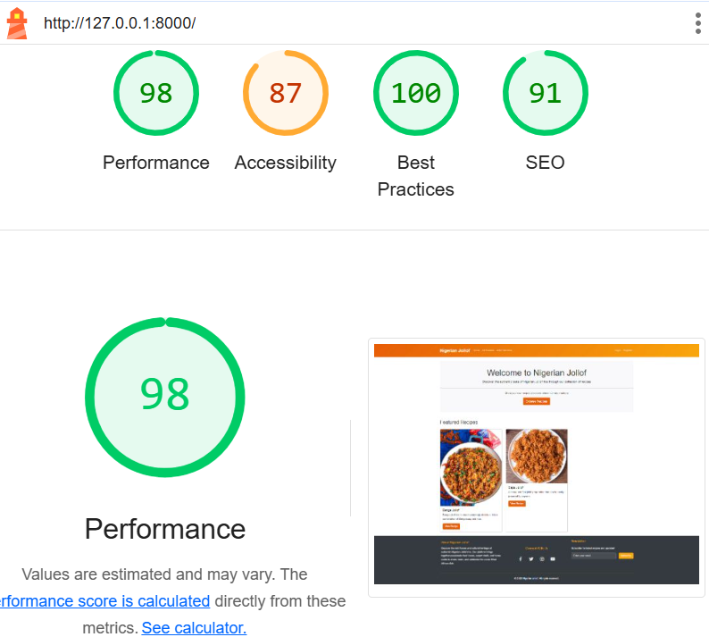
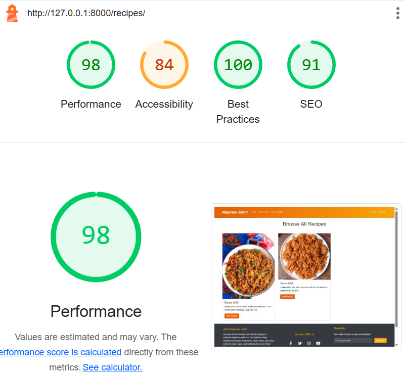
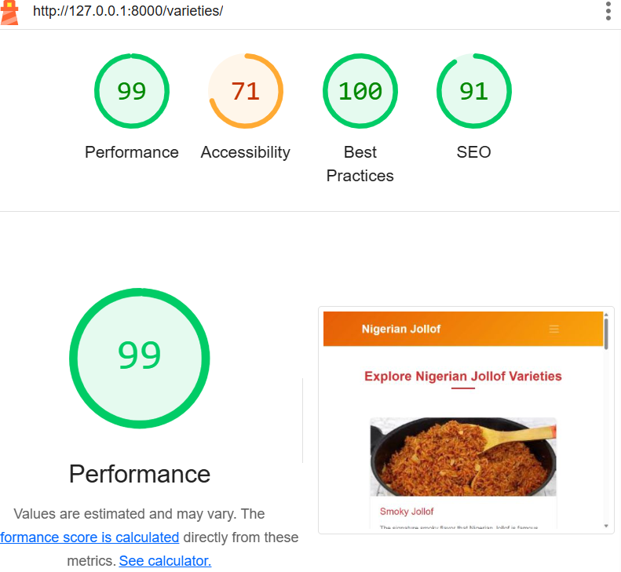
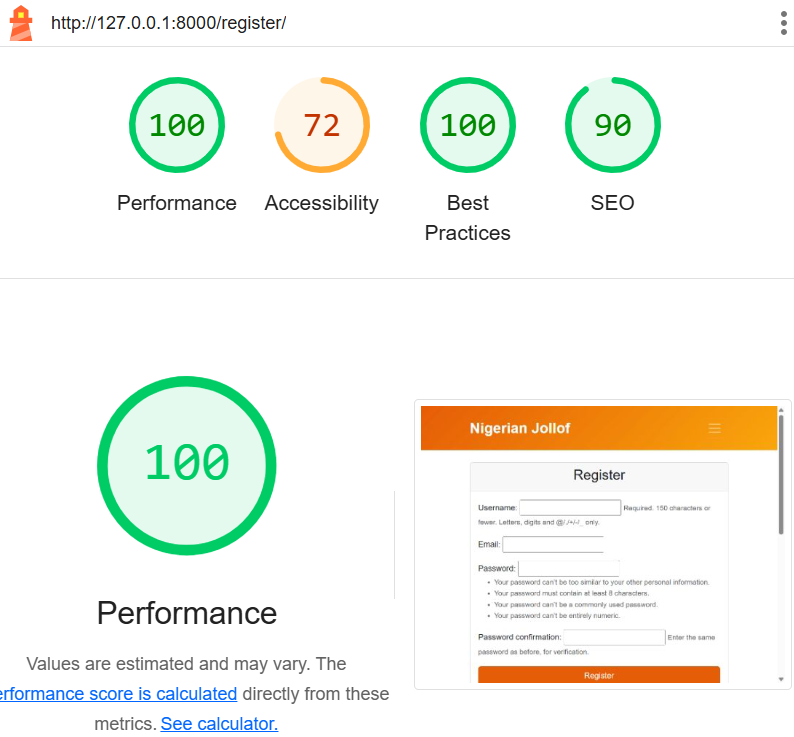

# Nigerian Jollof Recipe Website Testing

Return to [README](README.md).

1. [**SYSTEM Testing**](#SYSTEM-Testing)
     - [**Manual Testing Table**](#Manual-Testing-Table)
     - [**Automatic Testing Table**](#Automatic-Testing-Table)
  2. [**Overall Performance**](#Overall-Performance)
  3. [**Responsiveness & Compactability Testing**](#Responsiveness-&-Compactability-Testing)
  5. [**Code Validation**](#Code-Validation)
  7. [**JavaScript Testing**](#JavaScript-Testing)
        - **JS Hint**
  8. [**Python Testing**](#Python-Testing)
     - [**CI Python Linter**](#CI-Python-Linter)
  9. [**Summary**](#Summary)

   ------

## SYSTEM Testing

### Manual Testing Table

I conducted Manual testing for the
- **Add recipe**
- **Rating**
- **Comment**
- **Edit comment**
- **Delete comment**
- **Edit recipe**
- **Delete recipe**

In total I constructed 7 tests to test the majority of the functions within the Table, broken down into 7 sections:
This expanded table provides a comprehensive manual breakdown of expected outcomes.

 | **Category** | **Test Method**| **Expected Outcome** | **Detailed Validation Criteria** | **passed** | **comments** |
| --- | --- | --- | --- | --- | --- |
| **Add Recipe** | Navigate to Add Recipe page, fill all required fields (title, ingredients, instructions) and submit |  Recipe is successfully created and visible in the recipe list |  - All entered information is correctly saved - Recipe appears in appropriate listings - User receives confirmation message | Yes | - |
|  | Attempt to submit recipe form with missing required fields | Form validation prevents submission and displays error messages | - Appropriate error messages shown for each missing field - Form is not submitted | Yes | - |
|  | Add recipe with optional image upload | Recipe is created with the associated image | - Image is displayed with the recipe - Image is properly sized/formatted - Alternative text is available if specified | Yes | - |
| **Rating** | Unauthenticated user | redirect to login/register page |  HTTP 302 redirect status | Yes | - |
|  | Navigate to recipe detail page and submit a rating (1-5 stars) | Rating is recorded and visible on the recipe | - Star rating is visually updated - Average rating reflects the new input - User receives confirmation of rating submission | yes | - |
| **Comment** | Add a comment to a recipe | Comment appears in the comments | - Comment text is displayed correctly - User information and timestamp are shown - Comments are displayed in appropriate order (newest/oldest) | Yes | - |
|  | Attempt to submit an empty comment | System prevents submission and shows error message | - Error message is clear and user-friendly - Form focus remains on comment field - Submit action is blocked | Yes | - |
| **Edit Comment** | Edit user's own comment on a recipe | Comment is updated with the new text | - Original comment is replaced with edited version - User receives confirmation of successful edit | Yes | - |
|  | Attempt to edit another user's comment | Edit functionality is not available | - Edit button is not visible for other users' comments | Yes | - |
|  | Cancel editing a comment | Original comment remains unchanged | - Edit mode is exited - Original comment text is preserved | Yes | - |
| **Delete Comment** | Delete user's own comment | Comment is removed from the comments | - Comment no longer appears in the list - User receives confirmation of deletion | Yes | - |
|  | Attempt to delete another user's comment | Delete functionality is not available | - Delete button is not visible for other users' comments | Yes | - |
|  | Cancel comment deletion in confirmation dialog | Comment remains in the comments section | - Comment is not removed - No changes are made to the comment | Yes | - |
| **Edit Recipe** | Edit user's own recipe with updated information | Recipe is updated with the new information | - All modified fields are correctly updated - Original fields not edited remain unchanged | Yes | - |
|  | Attempt to edit another user's recipe | Edit functionality is not available | - Edit button is not visible for other users' recipes | Yes | - |
| **Edit Recipe** | Delete user's own recipe | Recipe is removed from the system | - Recipe no longer appears in listings - Associated data (comments, ratings) is removed - User receives confirmation of deletion | Yes | - |
|  | Attempt to delete another user's recipe | Delete functionality is not available | - Delete button is not visible for other users' recipes | Yes | - |
|  | Cancel recipe deletion in confirmation dialog | Recipe remains in the system | - Recipe is not removed - Confirmation dialog closes - No changes are made to the recipe | Yes | - |

---

### Automatic Testing

## Overall Performance

The site was tested on the lighthouse facility in Google Developer Tools to assess the overall performance of the site.

| Page         | Screenshot                                                      | Notes          |
|--------------|-----------------------------------------------------------------|----------------|
| Home Page | |  Meets criteria |                        
| All Recipes Page | |  Meets criteria |                        
| Jollof Varieties Page |  |  Meets criteria |                        
| Login Page | |  Meets criteria |                        
| Register Page | |  Meets criteria |                                           
| About Page | |  Meets criteria |                        

---